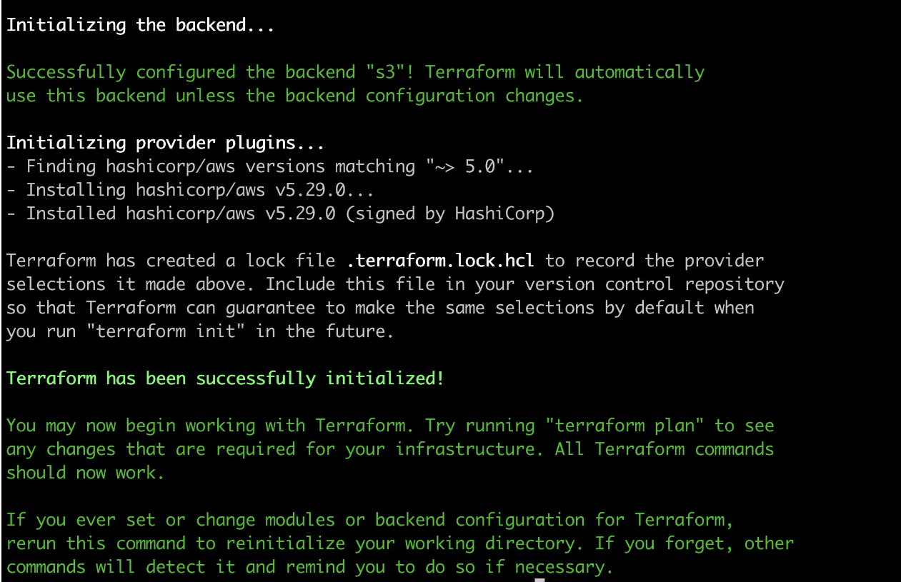
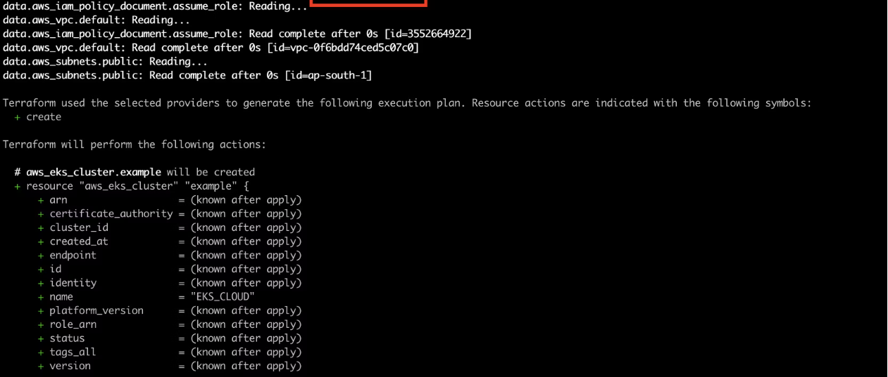

# Super Mario Game Deployment on EKS

---
[Live Project](http://a8140b2baab4e4202874e1e26d478b70-1877454674.us-east-1.elb.amazonaws.com/)

This project involves deploying a Super Mario game application on an Amazon EKS (Elastic Kubernetes Service) cluster. The deployment process is divided into several phases, each focusing on specific tasks to ensure a smooth and secure deployment.

## Purpose and Scope

### Purpose

The purpose of this project is to demonstrate the deployment of a containerized application, specifically a Super Mario game, on Amazon Elastic Kubernetes Service (EKS). The project showcases a complete deployment lifecycle, including setup, security configuration, application deployment, monitoring, and cleanup. By following this guide, users will gain practical experience with key AWS services and tools such as EC2, IAM, Terraform, kubectl, and AWS CLI.

### Scope

This documentation is intended for DevOps engineers, cloud architects, and developers who are interested in deploying applications on Kubernetes using AWS EKS. The scope covers the following phases:

- Initial Setup and Deployment
- Security and IAM Configuration
- Application Deployment
- Monitoring and Validation
- Cleanup and Resource Management

### Infrastructure as Code (IaC) with Terraform

Terraform is used as the infrastructure as code (IaC) tool to provision and manage the AWS infrastructure required for this project. The Terraform configuration files will automate the creation of the EKS cluster, IAM roles, and policies, ensuring a repeatable and consistent deployment process.

The documentation includes step-by-step instructions, command-line examples, and configuration details to ensure a successful deployment and management of the Super Mario game application on AWS EKS.

## Features and Functionality

### Features

- **Automated Infrastructure Setup**: Provisioning of AWS resources using Terraform.
- **Secure Access Management**: Configuration of IAM roles and policies to ensure secure access to AWS resources.
- **Containerized Application Deployment**: Deployment of the Super Mario game application on Amazon EKS.
- **Load Balancer Integration**: Exposure of the application via an AWS Load Balancer for high availability.
- **Monitoring and Validation**: Verification and monitoring of the application's deployment status.
- **Resource Cleanup**: Automated cleanup of AWS resources post-deployment.

### Key Functionalities

1. **EC2 Instance Setup**: Launching an EC2 instance to serve as the initial setup environment.
2. **Tool Installation**: Installing necessary tools such as Terraform, AWS CLI, and kubectl on the EC2 instance.
3. **IAM Role Configuration**: Creating and attaching IAM roles and policies for secure access management.
4. **Repository Cloning**: Cloning the Git repository containing the application and Terraform configuration files.
5. **EKS Cluster Deployment**: Using Terraform to deploy the EKS cluster and related resources.
6. **Application Deployment**: Deploying the containerized Super Mario game on the EKS cluster.
7. **Application Exposure**: Exposing the application via a Kubernetes service and AWS Load Balancer.
8. **Deployment Verification**: Verifying the successful deployment and operation of the application.
9. **Resource Cleanup**: Deleting the Kubernetes deployment and destroying the EKS cluster to clean up resources.

## Technologies Used

### AWS Management Console

The AWS Management Console provides a web-based user interface to manage AWS services and resources. It is used for launching EC2 instances, managing IAM roles, and monitoring deployed resources.

### Ubuntu

Ubuntu is a popular Linux distribution used as the operating system for the EC2 instance. It provides a stable and secure environment for installing and running the necessary tools.

### Windows

Windows is used as the development machine for setting up and managing the project before deploying it to the cloud environment.

### AWS IAM (Identity and Access Management)

IAM is used to create and manage AWS users and permissions. In this project, IAM roles and policies are configured to control access to EC2 and EKS resources securely.

### Terraform

Terraform is an open-source infrastructure as code (IaC) tool used to define and provision the AWS infrastructure required for this project. Terraform configuration files automate the creation of the EKS cluster, IAM roles, and policies.

### AWS CLI (Command Line Interface)

The AWS CLI is a unified tool to manage AWS services from the command line. It is used for various tasks such as configuring the AWS environment and interacting with AWS services programmatically.

### kubectl

kubectl is the command-line tool for interacting with Kubernetes clusters. It is used to deploy, manage, and troubleshoot applications running on the EKS cluster.

### Docker

Docker is a platform for developing, shipping, and running applications in containers. The Super Mario game application is containerized using Docker and deployed on the EKS cluster.

### Git

Git is a version control system used to manage the source code for the Super Mario game application and Terraform configuration files. The repository is cloned to the EC2 instance for deployment.

### S3 (Simple Storage Service)

Amazon S3 is used to store the Terraform state files. Storing the state files in S3 ensures consistency and enables collaboration in a team environment.

### SSH Client

An SSH client is used to securely connect to the EC2 instance for setup and management. Common examples include the terminal application on Unix-based systems and PuTTY on Windows.

### PuTTY

PuTTY is a free and open-source terminal emulator, serial console, and network file transfer application used to connect to the EC2 instance from a Windows development machine.

### Visual Studio Code (VS Code)

Visual Studio Code is a source-code editor used for editing Terraform configurations, Dockerfiles, and other code related to the project. It provides extensions for syntax highlighting, code completion, and version control integration.

### Kubernetes

Kubernetes is an open-source container orchestration system used to automate the deployment, scaling, and management of containerized applications. EKS (Elastic Kubernetes Service) is a managed Kubernetes service provided by AWS.

### Amazon EC2 (Elastic Compute Cloud)

Amazon EC2 provides scalable computing capacity in the AWS cloud. It is used to launch and manage virtual servers where the necessary tools for deployment are installed.

### Amazon EKS (Elastic Kubernetes Service)

Amazon EKS is a managed Kubernetes service that makes it easy to run Kubernetes on AWS without needing to install and operate your own Kubernetes control plane or nodes.

### VPC (Virtual Private Cloud)

Amazon VPC enables you to launch AWS resources into a virtual network that you've defined. It provides complete control over your virtual networking environment, including selection of your own IP address range, creation of subnets, and configuration of route tables and network gateways.

### Node Groups

Node groups are a part of Amazon EKS and represent a group of worker nodes (EC2 instances) that are used to run Kubernetes pods. The nodes in a node group are managed as a single unit.

### Subnets

Subnets are a range of IP addresses in your VPC. Subnets allow you to group resources based on security and operational needs. The EKS cluster is deployed within specific subnets.

### Terraform Cloud

Terraform Cloud is a service provided by HashiCorp for remote Terraform execution, state management, and collaboration. It helps to securely store and manage the Terraform state files.

### GitHub Actions

GitHub Actions is a CI/CD platform that automates the build, test, and deployment pipeline. It is used to automate the process of building, testing, and deploying the Super Mario game application.

## Installation instructions

### Launch Ubuntu instance

- **Sign in to AWS Console**: Log in to your AWS Management Console.
- **Navigate to EC2 Dashboard**: Go to the EC2 Dashboard by selecting “Services” in the top menu and then choosing “EC2” under the Compute section.
- **Launch Instance**: Click on the “Launch Instance” button to start the instance creation process.
- **Choose an Amazon Machine Image (AMI)**: Select an appropriate AMI for your instance. For example, you can choose Ubuntu image.
- **Choose an Instance Type**: In the “Choose Instance Type” step, select t2.micro as your instance type. Proceed by clicking “Next: Configure Instance Details.”
- **Configure Instance Details**: For “Number of Instances,” set it to 1 (unless you need multiple instances). Configure additional settings like network, subnets, IAM role, etc., if necessary. For “Storage,” click “Add New Volume” and set the size to 8GB (or modify the existing storage to 8GB). Click “Next: Add Tags” when you’re done.
- **Add Tags (Optional)**: Add any desired tags to your instance. This step is optional, but it helps in organizing instances.
- **Configure Security Group**: Choose an existing security group or create a new one. Ensure the security group has the necessary inbound/outbound rules to allow access as required.
- **Review and Launch**: Review the configuration details. Ensure everything is set as desired.
- **Select Key Pair**: Select “Choose an existing key pair” and choose the key pair from the dropdown. Acknowledge that you have access to the selected private key file. Click “Launch Instances” to create the instance.
- **Access the EC2 Instance**: Once the instance is launched, you can access it using the key pair and the instance’s public IP or DNS.

### Clone the Repo

```sh
git clone https://github.com/u-khan786/Super-m-clone.git
```

### Create IAM Role

- Search for IAM in the search bar of AWS and click on roles.
  
- Click on Create Role
  
- Select entity type as AWS service
  
- For permission policy select Administrator Access (Just for learning purpose), click Next.
  
- Provide a Name for Role and click on Create role.
  
- Role is created.
  
- Now Attach this role to Ec2 instance that we created earlier, so we can provision cluster from that instance.
- Go to EC2 Dashboard and select the instance.
- Click on Actions –> Security –> Modify IAM role.
  
- Select the Role that created earlier and click on Update IAM role.
  
- Connect the instance to Mobaxtreme or Putty

### Install tools

These steps ensure that necessary tools for managing infrastructure (Terraform), Kubernetes clusters (kubectl), and AWS resources (AWS CLI) are installed and configured on your system. Adjust paths and commands based on specific system requirements or preferences.

```sh
cd /tmp
```

```sh
# Install Terraform
sudo apt install wget -y  # Install wget if not already installed
wget -O- https://apt.releases.hashicorp.com/gpg | sudo gpg --dearmor -o /usr/share/keyrings/hashicorp-archive-keyring.gpg # Download and add HashiCorp GPG key
echo "deb [signed-by=/usr/share/keyrings/hashicorp-archive-keyring.gpg] https://apt.releases.hashicorp.com $(lsb_release -cs) main" | sudo tee /etc/apt/sources.list.d/hashicorp.list # Add HashiCorp repository to apt sources list
sudo apt update && sudo apt install terraform -y # Update package index and install Terraform
```

This section installs Terraform by adding HashiCorp's official GPG key to verify package integrity and adding their APT repository. After updating the package index, it installs Terraform automatically.

```sh
# Install kubectl
sudo apt update # Update package index
sudo apt install curl -y # Install curl if not already installed
curl -LO https://dl.k8s.io/release/$(curl -L -s https://dl.k8s.io/release/stable.txt)/bin/linux/amd64/kubectl # Download the latest stable version of kubectl
sudo install -o root -g root -m 0755 kubectl /usr/local/bin/kubectl # Install kubectl binary to /usr/local/bin/
kubectl version --client # Verify kubectl installation and display client version
```

This segment installs kubectl, the Kubernetes command-line tool, by downloading the latest stable version for Linux amd64 architecture. It then installs it globally so it can be accessed from any directory and verifies the installation by displaying the client version.

```sh
# Install AWS CLI
curl "https://awscli.amazonaws.com/awscli-exe-linux-x86_64.zip" -o "awscliv2.zip" # Download AWS CLI installation archive
sudo apt-get install unzip -y # Install unzip utility if not already installed
unzip awscliv2.zip # Unzip the AWS CLI installation archive
sudo ./aws/install # Run the AWS CLI installation script
```

This part installs the AWS Command Line Interface (CLI) by downloading the installation archive, extracting it, and running the installation script. The AWS CLI allows you to interact with various AWS services from the command line.

```sh
 aws --version && kubectl version --client && terraform --version
```

- aws --version: Displays the version of AWS CLI installed on your system.
- kubectl version --client: Displays the client version of kubectl installed on your system, which is used to interact with Kubernetes clusters.
- terraform --version: Displays the version of Terraform installed on your system, used for provisioning and managing infrastructure as code.

### Cluster provision

```sh
cd /home/ubuntu/Super-m-clone
```

- Run Terraform init

```sh
terraform init
```



> NOTE: Don’t forgot to change the s3 bucket name and aws region name in the infrastructure.tf file

- Now run terraform validate and terraform plan

```sh
terraform validate
terraform plan
```




- Now Run terraform apply to provision cluster.

```sh
terraform apply --auto-approve
```


> NOTE: Completed in 2/3 mins

- Update the Kubernetes configuration

```sh
aws eks update-kubeconfig --name mario_cluster --region us-east-1
```

> NOTE: Make sure change your desired region

### Deployment

```sh
kubectl apply -f deployment.yaml
kubectl apply -f service.yaml
kubectl get all
kubectl describe service mario-service
```


## Summary and Conclusion

In this project, we successfully deployed the Super Mario game application on an Amazon EKS cluster using a detailed, step-by-step approach. We covered the following phases:

1. **Initial Setup and Deployment:** We launched an EC2 instance, installed necessary tools, and configured the environment.
2. **Security and IAM Configuration:** We created IAM roles and policies for the EKS cluster and node groups, ensuring secure and appropriate permissions.
3. **Application Deployment:** We cloned the repository, deployed the application using Terraform, and exposed it via a Load Balancer.
4. **Monitoring and Validation:** We verified the deployment and monitored the application's status using kubectl commands.
5. **Cleanup and Resource Management:** We deleted the application deployment and destroyed the EKS cluster and associated resources using Terraform.

This project demonstrated the power and flexibility of AWS services, Terraform, and Kubernetes in deploying and managing scalable applications. By following this documentation, users can replicate the process and understand the key components involved in deploying containerized applications on EKS.

The project also highlighted the importance of infrastructure as code (IaC) for automating deployments and managing infrastructure efficiently. With Terraform, we defined our infrastructure in a declarative manner, making the deployment process repeatable and version-controlled.

Overall, this project serves as a practical example of modern DevOps practices and cloud-native application deployment, providing valuable insights into building and managing cloud infrastructure.

## References and Acknowledgments

### References

1. **AWS Documentation**

   - [Amazon EKS User Guide](https://docs.aws.amazon.com/eks/latest/userguide/what-is-eks.html)
   - [Amazon EC2 User Guide](https://docs.aws.amazon.com/ec2/index.html)
   - [IAM Roles and Policies](https://docs.aws.amazon.com/IAM/latest/UserGuide/access_policies.html)
   - [Terraform AWS Provider Documentation](https://registry.terraform.io/providers/hashicorp/aws/latest/docs)

2. **Terraform Documentation**

   - [Terraform CLI Documentation](https://www.terraform.io/docs/cli-index.html)
   - [Terraform AWS Provider](https://registry.terraform.io/providers/hashicorp/aws/latest/docs)

3. **Kubernetes Documentation**

   - [Kubernetes Documentation](https://kubernetes.io/docs/home/)
   - [kubectl Documentation](https://kubernetes.io/docs/reference/kubectl/)

4. **GitHub Actions Documentation**
   - [GitHub Actions](https://docs.github.com/en/actions)

### Acknowledgments

- **Open Source Contributors** for maintaining and enhancing the tools and frameworks used in this project, including Terraform, Kubernetes, and AWS CLI.
- **Community Forums and Support** for invaluable assistance and resources available to troubleshoot and optimize various aspects of the deployment process.
